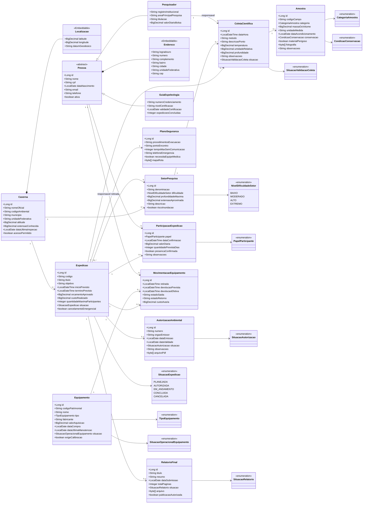

# Modelagem Conceitual

Este documento registra a modelagem conceitual inicial do dominio TurmalinaPB. A etapa atual descreve entidades persistentes planejadas, objetos incorporaveis, enumeracoes e relacionamentos principais, sem implementar classes Java, mapeamentos JPA ou migrations.

`Pessoa` foi planejada como superclasse abstrata de uma hierarquia JPA com estrategia `JOINED`, contendo pelo menos `Pesquisador` e `GuiaEspeleologia`. `Localizacao` e `Endereco` foram modelados como objetos incorporaveis, sem identidade propria e sem tabela propria.

## Observacoes de modelagem

- `ParticipacaoExpedicao` e uma entidade associativa planejada entre `Pessoa` e `Expedicao`, com identidade propria.
- A combinacao entre pessoa e expedicao em `ParticipacaoExpedicao` devera ser unica quando o mapeamento persistente for implementado.
- `Expedicao` deve possuir exatamente um `PlanoSeguranca`.
- `AutorizacaoAmbiental` e `RelatorioFinal` sao opcionais para uma `Expedicao`.
- Os valores de `SituacaoExpedicao` e `NivelDificuldadeSetor` ja foram definidos pelo enunciado.
- Os valores dos demais enums serao refinados em etapa posterior.

## Pessoas, objeto incorporável e herança

A classe é abstrata porque o cadastro deve representar uma especialização concreta, como `Pesquisador` ou `GuiaEspeleologia`. 
Essa estrutura permite acrescentar outras especializações no futuro sem duplicar os dados comuns, por isso foi escolhido a especializações das entidades com a estratégia `@Inheritance(strategy = InheritanceType.JOINED)`. 
Os atributos compartilhados ficam em `tb_pessoa`, enquanto cada especialização possui uma tabela própria com os atributos específicos e uma 
chave primária vinculada à chave de `tb_pessoa` que é definida como `Long` com `GenerationType.IDENTITY`, e herdado pelas subclasses, não se declara um novo `@Id` em cada uma. 
A estratégia evita colunas de pesquisador na tabela de guia e vice-versa, mantendo os campos específicos obrigatórios em suas tabelas.
`Endereco` é um objeto de valor mapeado com `@Embeddable`, o campo correspondente em `Pessoa` utiliza `@Embedded`. 
Seus atributos são colunas da própria `tb_pessoa`, sem identidade nem tabela de endereço. 
As colunas obrigatórias impedem que um endereço inteiramente nulo seja persistido quando o esquema relacional possuir as restrições `NOT NULL`.
Os limites explícitos de nome, CPF, e-mail e telefone restringem os dados de acordo com o domínio. 
O CPF recebe `unique = true` e é armazenado como texto de até 11 caracteres, preservando zeros à esquerda. 
`LocalDate` representa nascimento e validade de certificação, pois esses valores não exigem hora. 
A situação ativa usa `boolean`, correspondente ao tipo booleano do PostgreSQL, sem conversão para caracteres.

## Coleta científica e suas associações

A situação de validação é um enum Java persistido por `@Enumerated(EnumType.STRING)`: nomes como `PENDENTE`, `VALIDADA` e `REJEITADA` são legíveis e não dependem da posição dos elementos no enum. 
Alterar o nome de uma constante futuramente exigirá tratar os valores já gravados no banco.
Cada coleta pertence a uma expedição, ocorre em um setor e possui um pesquisador responsável. 
As três associações são `@ManyToOne`, com `@JoinColumn(nullable = false)`, porque uma expedição, um setor e um pesquisador podem estar relacionados a várias coletas. 
As colunas de chave estrangeira ficam em `tb_coleta_cientifica`, por isso, `ColetaCientifica` é o lado proprietário dessas relações. 
O nome da coluna que aponta para `Pesquisador` pode ser `id_pesquisador` mesmo que a chave herdada na tabela de destino se chame `id_pessoa`, o esquema precisa referenciar a tabela da especialização para exigir que o responsável seja efetivamente um pesquisador.
Essas referências foram configuradas como `LAZY` para evitar trazer expedição, setor e pessoa em consultas que precisam somente dos dados da coleta. 
Quando a tela ou consulta precisar exibir setor e pesquisador, deve buscá-los explicitamente na mesma consulta, por exemplo com `JOIN FETCH`, enquanto o `EntityManager` estiver aberto. 
Isso reduz consultas adicionais repetidas ao percorrer uma lista de coletas.

## Amostras, integridade e ciclo de vida

Uma coleta pode gerar várias amostras, com isso em `ColetaCientifica`, a lista usa `@OneToMany(mappedBy = "coleta", fetch = LAZY)`.
Em `Amostra`, o campo `coleta` usa `@ManyToOne` e `@JoinColumn(nullable = false)`. 
Portanto, a chave estrangeira pertence a `tb_amostra` e **`Amostra` é o lado proprietário**. 
Um método de inclusão deve atualizar os dois lados em memória: adicionar a amostra à lista e executar `amostra.setColeta(this)`.
A coleção é carregada sob demanda, pois listar coletas não exige recuperar todas as suas amostras. 
`cascade = CascadeType.ALL` e `orphanRemoval = true` expressam a decisão de que as amostras têm ciclo de vida dependente da coleta: ao persistir a coleta, as amostras associadas podem ser persistidas junto; 
ao remover uma amostra da coleção, ela pode ser excluída do banco. Essa escolha só é adequada se uma amostra não puder continuar existindo sem sua coleta. 
Ao atualizar, deve-se modificar a coleção gerenciada em vez de substituí-la com `setAmostras(...)`, a retirada de um elemento significa exclusão. 
Não se aplica essa cascata às associações com `Pesquisador`, `SetorPesquisa` e `Expedicao`, que existem independentemente da coleta.
`Amostra` possui identificador autogerado e código de campo com `unique = true`, conforme a exigência de unicidade. 
Categoria e condição de conservação são enums persistidos como `STRING`, isso torna os valores legíveis e evita que a reordenação das constantes altere o significado dos dados.
A fotografia é um `byte[]` mapeado com `@Lob`, mantendo o conteúdo binário no domínio, sem Base64. 
`@Basic(fetch = LAZY)` indica a intenção de carregá-la apenas quando necessário, mas o carregamento tardio de atributos básicos depende do suporte e da configuração do provedor. 
Por isso, as consultas de listagem devem selecionar explicitamente somente os atributos necessários, sem fotografia, uma consulta separada atende ao download do arquivo.
